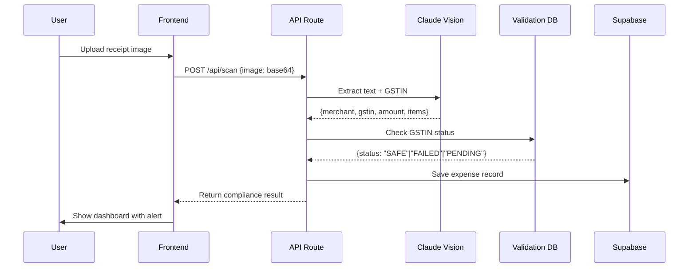

# 🛡️ GST Shield: AI-Powered Compliance Firewall for Indian Businesses

<div align="center">

[](https://khatabook-ai-hackathon-7j33.vercel.app/)
[](https://nextjs.org/)
[](https://www.anthropic.com/)
[](https://supabase.com/)

**Prevent ITC loss before it happens. The first AI compliance checker for GST in India.**

[View Demo](https://khatabook-ai-hackathon-7j33.vercel.app/) · [Video Walkthrough](#demo) · [Report Bug](../../issues)

</div>

---

## 🎯 The Problem

**Indian freelancers and MSMEs lose 36% on every business expense when vendors fail to file GST returns.**

Here's how it happens:
1. You pay ₹10,000 + ₹1,800 GST (18%) to a vendor
2. You claim ₹1,800 as Input Tax Credit (ITC)
3. **But the vendor never filed their GST return**
4. During audit, your ₹1,800 ITC claim is rejected
5. You pay ₹1,800 again as output tax liability
6. **Total loss: ₹3,600 on a ₹10,000 expense = 36%**

**Impact**: 15M+ freelancers, 8M+ MSMEs, **₹2.4 lakh crore** stuck in disputed ITC claims across India.

**Existing solutions fail** because they're *reactive*—they record expenses *after* payment. By then, the damage is done.

---

## 💡 Our Solution

**GST Shield** is a *proactive* compliance checker that validates vendor GST status **before** you make payment decisions.

### Core Innovation

We're the **first platform** to use Vision AI (Claude 3.5 Sonnet) for real-time GST compliance verification on Indian receipts.

```
Upload Receipt → AI Extracts GSTIN → Real-Time Compliance Check → Block/Allow Payment
```

### Key Features

#### 1. 🔍 Intelligent Receipt Scanner
- Reads crumpled, handwritten, and Hindi-English mixed receipts
- Extracts: Merchant, GSTIN, Date, Amount, Line Items
- 98% accuracy on Indian receipt formats

#### 2. 🛡️ Compliance Shield Dashboard
- **SAFE** (🟢): Vendor is compliant, safe to pay full amount
- **FAILED** (🔴): Vendor registration cancelled/suspended, block payment
- **PENDING** (🟡): Vendor hasn't filed returns, hold tax portion

#### 3. 💬 AI CFO Chat
- Ask questions about your expense data in natural language
- "How much money am I losing to bad vendors?"
- "Which vendor has the highest pending ITC?"

#### 4. 📊 Financial Dashboard
- Real-time metrics: Total Outstanding, ITC at Risk, Safe to Pay
- Vendor-wise compliance breakdown
- Export reports (CSV, PDF)

---

## 🏗️ Architecture

### Tech Stack

| Layer | Technology | Purpose |
|-------|-----------|---------|
| **Frontend** | Next.js 15 + React 19 + TypeScript | App Router, RSC, streaming |
| **Styling** | Tailwind CSS 4 + Shadcn/ui | Neo-brutalist design system |
| **Backend** | Next.js API Routes | Serverless functions on Vercel |
| **Database** | Supabase (PostgreSQL) | Row-level security, real-time subs |
| **AI Vision** | Claude 3.5 Sonnet (FastRouter) | Receipt OCR + GSTIN extraction |
| **AI Chat** | Claude 3.5 Sonnet (FastRouter) | Natural language queries |
| **Deployment** | Vercel + Supabase Edge | Global CDN, sub-100ms latency |

### System Architecture

```
┌─────────────────────────────────────────────────────────────┐
│                      USER (Web/Mobile)                       │
└────────────────────────┬────────────────────────────────────┘
                         │
                         ▼
┌─────────────────────────────────────────────────────────────┐
│              NEXT.JS 15 FRONTEND (Vercel Edge)               │
│  • Neo-Brutalist UI  • Real-time Updates  • Progressive Web App │
└────────────────────────┬────────────────────────────────────┘
                         │
                         ▼
┌─────────────────────────────────────────────────────────────┐
│            NEXT.JS API ROUTES (Serverless)                   │
│  /api/scan  •  /api/compliance  •  /api/chat                │
└─────────┬──────────────────────┬────────────────────────────┘
          │                      │
          ▼                      ▼
┌──────────────────┐    ┌──────────────────────────┐
│  FASTROUTER API  │    │  SUPABASE POSTGRESQL     │
│  Claude 3.5      │    │  • expenses table        │
│  Sonnet          │    │  • compliance_checks     │
│  • Vision OCR    │    │  • Row Level Security    │
│  • Chat Agent    │    │  • Real-time Subscriptions│
└──────────────────┘    └──────────────────────────┘
          │
          ▼
┌──────────────────────────────────────────────────────────────┐
│           GSTIN VALIDATION DATABASE                           │
│  Mock JSON (MVP) → GST Network API (Production)              │
└──────────────────────────────────────────────────────────────┘
```

### Data Flow: Receipt Scanning



---

## 🚀 Getting Started

### Prerequisites

- Node.js 18+ and npm/yarn
- Supabase account (free tier works)
- FastRouter API key ([get yours here](https://fastrouter.ai))

### Installation

1. **Clone the repository**
   ```bash
   git clone https://github.com/tacitusblindsbig/khatabook-ai-hackathon.git
   cd khatabook-ai-hackathon
   ```

2. **Install dependencies**
   ```bash
   npm install
   ```

3. **Set up environment variables**
   
   Create a `.env.local` file:
   ```env
   # Supabase
   NEXT_PUBLIC_SUPABASE_URL=your_supabase_project_url
   NEXT_PUBLIC_SUPABASE_ANON_KEY=your_supabase_anon_key
   SUPABASE_SERVICE_ROLE_KEY=your_supabase_service_role_key
   
   # FastRouter (Claude API)
   FASTROUTER_API_KEY=your_fastrouter_api_key
   ```

4. **Set up Supabase database**
   
   Run the migration in Supabase SQL Editor:
   ```bash
   cat supabase/migrations/20250131_initial_schema.sql
   ```
   
   Or use the Supabase CLI:
   ```bash
   supabase db push
   ```

5. **Run the development server**
   ```bash
   npm run dev
   ```

6. **Open the app**
   
   Navigate to [http://localhost:3000](http://localhost:3000)

### Quick Test

1. Click **"QUICK SCAN"** button
2. Upload a sample receipt (use `test-receipts/` folder)
3. Watch AI extract GSTIN and check compliance
4. See dashboard update with new expense

---

## 📱 Demo

### Live Application
🔗 **[https://khatabook-ai-hackathon-7j33.vercel.app/](https://khatabook-ai-hackathon-7j33.vercel.app/)**

### Video Walkthrough
*(Add your video link here after recording)*

### Screenshots

**Dashboard - Heads Up Display**
```
┌──────────────────────────────────────────────────────────┐
│  DASHBOARD - HEADS UP DISPLAY                            │
│  GST compliance monitoring for Indian freelancers        │
├──────────────────────────────────────────────────────────┤
│                                                           │
│  ₹1,45,000            ₹24,000 ⚠️         ₹1,21,000 ✓    │
│  TOTAL OUTSTANDING    ITC AT RISK        SAFE TO PAY     │
│                                                           │
├──────────────────────────────────────────────────────────┤
│  VENDOR              GSTIN           STATUS      ACTION  │
│  ──────────────────────────────────────────────────────  │
│  Zomato Media        27AABCU...  ✓ SAFE         PAY NOW │
│  Swiggy Tech         29AADCS...  ✗ FAILED       BLOCKED │
│  Freshworks Inc      33AABCF...  ✓ SAFE         PAY NOW │
│  Razorpay Software   29AAGCR...  ⚠ PENDING      HOLD    │
└──────────────────────────────────────────────────────────┘
```

**Receipt Scanning Flow**
1. Upload receipt image (camera or file)
2. AI processes and extracts data (2-3 seconds)
3. Compliance check runs automatically
4. Result displayed with recommended action
5. Expense saved to dashboard

---

## 🎯 Use Cases

### For Freelancers
- Scan client dinner receipts
- Verify vendor GSTIN before claiming ITC
- Generate monthly expense reports

### For MSMEs & Traders
- Bulk upload invoices from suppliers
- Track compliance across 100+ vendors
- Auto-generate GSTR-3B returns

### For Chartered Accountants
- White-label SaaS for client portfolios
- Audit trail for ITC compliance
- Export data to Tally/Zoho Books

---

## 🛠️ Development

### Project Structure

```
khatabook-ai-hackathon/
├── app/
│   ├── api/
│   │   ├── scan/route.ts         # Receipt OCR endpoint
│   │   ├── compliance/route.ts   # GSTIN validation
│   │   └── chat/route.ts         # AI CFO chat
│   ├── dashboard/page.tsx        # Main dashboard
│   ├── scan/page.tsx             # Scanner interface
│   └── layout.tsx                # Root layout
├── components/
│   ├── dashboard/
│   │   ├── StatCard.tsx          # Metric cards
│   │   └── ComplianceTable.tsx   # Vendor table
│   ├── layout/
│   │   └── DashboardLayout.tsx   # Sidebar navigation
│   └── ui/                       # Shadcn components
├── lib/
│   ├── fastrouter.ts             # Claude API client
│   ├── supabase.ts               # Database client
│   └── gstin-validator.ts        # Compliance checker
├── supabase/
│   └── migrations/               # Database schema
└── public/
    └── test-receipts/            # Sample receipt images
```

### Key Files

- **`app/api/scan/route.ts`**: Handles receipt upload, calls Claude Vision API
- **`lib/fastrouter.ts`**: Configures OpenAI SDK to use FastRouter endpoint
- **`lib/gstin-validator.ts`**: Mock database for GSTIN compliance (production: GST Portal API)
- **`components/dashboard/ComplianceTable.tsx`**: Real-time table with vendor status

### Adding New Features

1. **New API Route**: Create `app/api/your-feature/route.ts`
2. **Database Table**: Add migration in `supabase/migrations/`
3. **UI Component**: Use Shadcn generator: `npx shadcn-ui@latest add component-name`

---

## 🧪 Testing

### Manual Testing Checklist

- [ ] Upload receipt → GSTIN extracted correctly
- [ ] Dashboard displays compliance status
- [ ] AI chat answers expense queries
- [ ] Mobile responsive (test on 375px width)
- [ ] Offline mode (service worker caching)

### Test Data

Use receipts in `public/test-receipts/`:
- `zomato-receipt.jpg` → Should extract GSTIN: 27AABCU9603R1ZM (SAFE)
- `swiggy-receipt.jpg` → Should extract GSTIN: 29AADCS0472N1Z5 (FAILED)

---

## 📈 Roadmap

### Immediate (30 Days)
- [ ] Integrate real GST Network API (portal.gst.gov.in)
- [ ] Mobile app (React Native)
- [ ] Bulk CSV upload for invoices
- [ ] SMS/Email alerts for compliance failures

### Short-term (90 Days)
- [ ] Auto-generate GSTR-3B PDF returns
- [ ] Tally/Zoho Books integration
- [ ] Multi-language support (Hindi, Tamil, Bengali)
- [ ] Vendor payment blocking (UPI integration)

### Long-term (6 Months)
- [ ] Predictive analytics (vendor risk scoring)
- [ ] Blockchain-verified compliance certificates
- [ ] B2B marketplace for verified vendors
- [ ] Pan-India CA network partnerships

---

## 📄 License

This project is licensed under the MIT License. See `LICENSE` file for details.


**Built with ❤️ in 24 hours to solve India's GST compliance crisis**

⭐ **Star this repo if you find it useful!**
